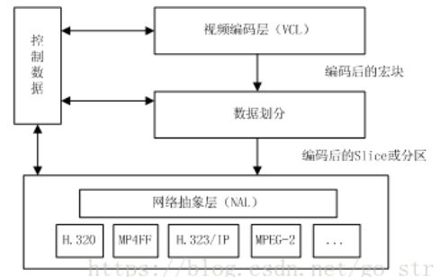
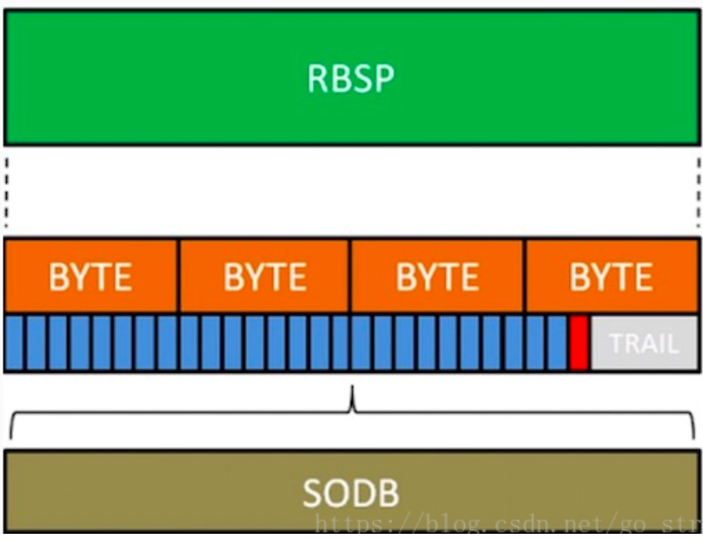
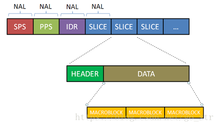
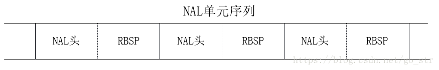

#### 相关概念
1. 序列
    * 有相同特点的一段数据
    * 一定时间内图像变化不大的图像集我们称之为一个序列
    * 如果某个图像与之前的图像变化很大，则结束上一个序列，开始下一段序列
2. 帧类型
    * 一帧由一片(slice)或多片组成
    * 一个片由一个或者多个宏块(MB)组成
    * 一个宏由16x16的yuv数据组成
    * 宏块是h264的基本单位
    * h264中分为三种帧类型：
        1. I帧 完整图像帧
        2. B帧 参考前后图像帧编码生成
        3. P帧 P帧是参考之前的I帧而生成的
3. GOP
    * 跟序列类似，一段时间内变化不大的图像集
    * 分为I帧和P帧之间的距离以及两个I帧之间的距离
    * I帧解码不依赖任何的其他帧，P帧解码则依赖前面的I帧或P帧
    * B帧解码以来前最近的一个I帧或P帧及其后最近的一个P帧
4. IDR帧
    * 即GOP中首个I帧，和其他I帧不同，方便控制编码和解码过程
    * IDR帧一定是I帧，但是I帧不一定是IDR帧
    * 作用是立刻刷新，使错误不至传播
    * 从IDR帧开始算新的序列开始编码
    * I帧有被跨帧参考的可能，IDR帧不会，如：
    + IDR1 P4 B2 B3   P7   B5 B6   I10   B8   B9 P13 B11 B12 P16 B14 B15 这里的B8可以跨过I10去参考P7
    + IDR1 P4 B2 B3 P7 B5 B6   IDR8   P11   B9   B10 P14 B11 B12 这里的B9就只能参照IDR8和P11，不可以参考IDR8前面的帧
    + IDR作用：
        * H.264引入 IDR 图像是为了解码的重同步，当解码器解码到 IDR图像时，立即将参考帧队列清空，将已解码的数据全部输出或抛弃，重新查找参数集，开始一个新的序列
        * IDR图像之后的图像永远不会使用IDR之前的图像的数据来解码 

#### 压缩方式
1. 帧内压缩
    * 生成I帧的算法，也称为空间压缩。当压缩一帧图像时，仅考虑本帧的数据而不考虑相邻帧之间的冗余信息，这实际上与静态图像压缩类似。一般采用有损压缩，由于帧内压缩是编码一个完整的图像，所以可以独立的解码，显示。
2. 帧间压缩
    * 生成B帧和P帧的算法，仅记录本帧与其相邻帧的差值，这样可以大大减少数据量，帧间压缩一般是无损的，

#### 分层结构
1. 有高的视频压缩比
    * 视频编码层面(VLC):对核心算法引擎、块、宏块及片的语法级别的定义，负责有效表示视频数据的内容，最终输出编码完的数据的SODB
    * SODB:数据比特串，是编码后的原始数据；
2. 良好的网络亲和性
    * 网络抽象层面(NAL):定义了片级以上的语法级别(如序列参数集，图像参数集)
    * NAL层讲SODB打包成RBSP然后加上NAL头组成一个NALU单元
    * RBSP:原始字节序列载荷，是在原始编码数据后面添加了结尾比特，一个bit"1"和若干个比特"0",用于字节对齐。
    
3. SODB和RBSP：

#### H264码流结构
1. h264码流结构如下：

h264码流是通过一个个NAL组成的，其中包括如下几个类型：
* SPS 
* PPS
* IDR
* SLICE
等

#### H264的NAL单元
1. 网络数据传输结构组成为：[NALU Header]+[RBSP]

* 实际网络数据传输过程中，H264的数据结构是以NALU(NAL单元)进行传输的
* 传输数据结构：NALU Header + RBSP
* 

#### H264编码知识
1. 
2. 

#### 

#### 相关资料
1. https://blog.csdn.net/go_str/article/details/80340564
2. https://www.freesion.com/article/5734197107/
3. https://blog.csdn.net/sdsszk/article/details/82229406
4. 